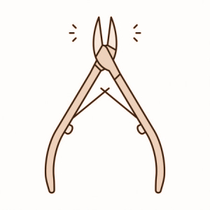

# Nipper

> Manipulation HTML with CSS Selectors.

<div>
  <!-- Crates version -->
  <a href="https://crates.io/crates/nipper">
    
  </a>
  <!-- Downloads -->
  <a href="https://crates.io/crates/nipper">
    
  </a>
  <!-- docs.rs docs -->
  <a href="https://docs.rs/nipper">
    
  </a>

  <a href="https://travis-ci.com/github/importcjj/nipper">
    
  </a>
</div>


Nipper based on HTML crate html5ever and the CSS selector crate selectors. You can use the jQuery-like syntax to query and manipulate an HTML document quickly. **Not only can query, but also can modify**.




## Example

#### Extract the hacker news.

```rust
use nipper::Document;

fn main() {
    let html = include_str!("../test-pages/hacker_news.html");
    let document = Document::from(html);

    document.select("tr.athing").iter().for_each(|athing| {
        let title = athing.select(".title a");
        let href = athing.select(".storylink");
        println!("{}", title.text());
        println!("{}", href.attr("href").unwrap());
        println!();
    });
}
```

#### Readability. 
[examples/readability.rs](./examples/readability.rs)

## Related projects

* [html5ever](https://crates.io/crates/html5ever)
* [selectors](https://crates.io/crates/selectors)
* [goquery](https://godoc.org/github.com/PuerkitoBio/goquery)
* [scraper](https://crates.io/crates/scraper)
* [select.rs](https://crates.io/crates/select)


## License

Licensed under either of

- Apache License, Version 2.0 ([LICENSE-APACHE](LICENSE-APACHE) or http://www.apache.org/licenses/LICENSE-2.0)
- MIT license ([LICENSE-MIT](LICENSE-MIT) or http://opensource.org/licenses/MIT)

at your option.

#### Contribution

Unless you explicitly state otherwise, any contribution intentionally submitted
for inclusion in the work by you, as defined in the Apache-2.0 license, shall be
dual licensed as above, without any additional terms or conditions.
